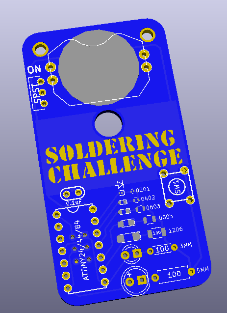

Introduction
============

 
Test your soldering skills, starting with standard through-hole components and work your way down into smaller and smaller surface mount components.  If you only get the through-hole components to light, you will still be greeted with a surprise if you spin the board on a pencil! 

Bill Of Materials
=================
  
- 1 ea., Perfect Purple PCB from OSH Park
- 1 ea., ATTINY24/44/84 14-PDIP (1.8V ~ 5.5V) https://www.digikey.com/short/zqwhcw
- 1 ea., CAP CER 0.1UF 
- 1 ea., SWITCH TACTILE SPST-NO 0.05A 24V, https://www.digikey.com/short/zqwh7q
- 1 ea., SPST Slide switch, EG1270, https://www.digikey.com/short/zqwh83
- 1 ea., 5mm LED Green diffuse, https://www.digikey.com/short/zqwh4h
- 1 ea., 100 OHM 1/4W resistor, https://www.digikey.com/short/zqwhp4
- 1 ea., 3mm LED Yellow diffuse, https://www.digikey.com/short/zqwhmf
- 1 ea., 100 OHM 1/6W resistor, https://www.digikey.com/short/zqwhpr
- 1 ea., LED RED CLEAR 1206 SMD, Lite-On LTST-C150KRKT, https://www.digikey.com/short/3253m7
- 1 ea., RES SMD 100 OHM 5% 1/4W 1206, Digiket P100ECT-ND
- 1 ea., LED ORANGE CLEAR 0805 SMD, https://www.digikey.com/short/qjwthb
- 1 ea., RES SMD 100 OHM 5% 1/8W 0805, https://www.digikey.com/short/z7nv19
- 1 ea., LED YELLOW CLEAR 0603 SMD, Lite-On LTST-C191KSKT, https://www.digikey.com/short/3wzzr2
- 1 ea., RES SMD 100 OHM 5% 1/10W 0603, https://www.digikey.com/short/z7n1cv
- 1 ea., LED GREEN CLEAR 0402 SMD, SunLED XZVG68W-2, https://www.digikey.com/short/3wzzfm
- 1 ea., RES 100 OHM 5% 1/16W 0402, https://www.digikey.com/short/z7n132
- 1 ea., LED BLUE CLEAR 0201 SMD, Kingbright APG0603PBC-TT-5MAV, https://www.digikey.com/short/3wzzfr
- 1 ea., RES SMD 100 OHM 5% 1/20W 0201, https://www.digikey.com/short/z7n18r

- 1 ea., BATTERY RETAINER COIN PC PIN, https://www.digikey.com/short/zqwh7h
- 1 ea. CR2032 Battery, Panasonic CR2032, Digikey P189-ND (requires ground shipping, or buy locally).

Design Files
============
This project is designed using Open Source [KiCad](http://kicad-pcb.org/). Design files are located in the [design_files](design_files/) folder.  You can oogle the [schematic](images/project.sch.png).

Firmware
========
This project is programed using the Open Source [Arduino](https://www.arduino.cc/). I use my Open Source [AVR Programming Shield](https://www.tindie.com/products/MakersBox/yet-another-programming-shield/) to program the Attiny. The firmware is located in the [firmware](firmware/) folder.

Assembly Instructions
=====================
TBD

License
=======
[Attribution-ShareAlike 3.0 United States (CC BY-SA 3.0 US)](https://creativecommons.org/licenses/by-sa/3.0/us/)

You are free to:

- Share — copy and redistribute the material in any medium or format
- Adapt — remix, transform, and build upon the material

Under the following terms:

- Attribution — You must give appropriate credit, provide a link to the license, and indicate if changes were made. You may do so in any reasonable manner, but not in any way that suggests the licensor endorses you or your use.
- ShareAlike — If you remix, transform, or build upon the material, you must distribute your contributions under the same license as the original.
