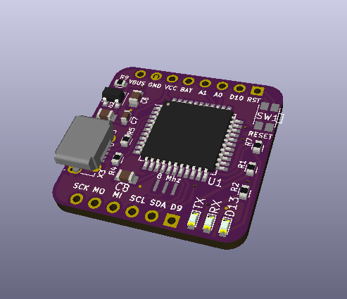

Beetje Bloks
----------------

 

What if breakout boards had a common footprint? You could design, build, and program larger projects in functional blocks and then synthesize the final project out of tested and characterized subsystems. 

This is a test of that concept. We are going to build things bit-by-bit. Since I sell a disproportionate number of kits to the [Netherlands](http://www.makersbox.us/2017/11/500-tindie-orders.html), I’m going to call these "Beetje Bloks", which translates from Dutch to “bit blocks”.  I’m not sure how to pronounce it.  Let’s say it “Beet-Cha”, as in, “I betcha can’t design a one-inch square dev board”.  I've written a lot more words about concept and execution on [Hack-A-Day](https://hackaday.io/project/160638-beetje-bloks).

The following Bloks have been designed / tested, with BOMs and particulars in their respective folders:

- [32U4 Dev Board V0.0](design_files_32U4)

License
----------------
[Attribution-ShareAlike 3.0 United States (CC BY-SA 3.0 US)](https://creativecommons.org/licenses/by-sa/3.0/us/)

You are free to:

- Share — copy and redistribute the material in any medium or format
- Adapt — remix, transform, and build upon the material

Under the following terms:

- Attribution — You must give appropriate credit, provide a link to the license, and indicate if changes were made. You may do so in any reasonable manner, but not in any way that suggests the licensor endorses you or your use.
- ShareAlike — If you remix, transform, or build upon the material, you must distribute your contributions under the same license as the original.
