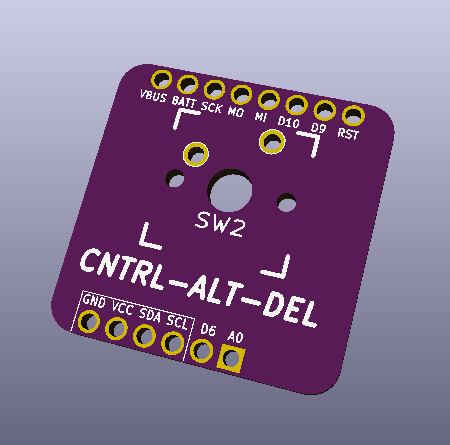

Beetje Blok Template

Project website: https://hackaday.io/project/160638-beetje-bloks
Cherry Key footprint: https://github.com/BathroomEpiphanies/KiCAD-Keyboard-Tutorial

Bill Of Materials
----------------
  
- 1 ea., Perfect Purple PCB from OSH Park, with not so perfect layout from [project.kicad_pcb](project.kicad_pcb) file.
- 1 ea.,  https://www.banggood.com/10-Pcs-Cherry-Red-3-Pin-MX-RGB-Series-Mechanical-Switch-Keyboard-Replacement-p-1114348.html
- 1 ea., https://www.banggood.com/R4-ESC-PBT-Red-Blank-Keycaps-Key-Caps-for-Mechanical-Gaming-Keyboard-p-1173201.html
- 1 ea., 64-pin header(enough for 4.5 boards) Mill-max 311-43-164-41-001000, https://www.digikey.com/short/jnqdm2

Firmware
-----------------
Since the 32U4 chip can act as a USB HID, it can send keystrokes (or mouse movements) to an attached computer.
Using the Arduino example sketch ([File]->[Examples]->[USB]->[Keyboard]->[KeyboardLogout]), we can send appropriate keystrokes to lock or unlock the computer.  Of course, putting your password in there is not a good idea, but locking and getting to the login screen with a single button press is.  Modified sketch (originally written by the Tom Igo!) is located in the [/firmware](/firmware)folder.

License
----------------
[Attribution-ShareAlike 3.0 United States (CC BY-SA 3.0 US)](https://creativecommons.org/licenses/by-sa/3.0/us/)

You are free to:

- Share — copy and redistribute the material in any medium or format
- Adapt — remix, transform, and build upon the material

Under the following terms:

- Attribution — You must give appropriate credit, provide a link to the license, and indicate if changes were made. You may do so in any reasonable manner, but not in any way that suggests the licensor endorses you or your use.
- ShareAlike — If you remix, transform, or build upon the material, you must distribute your contributions under the same license as the original.